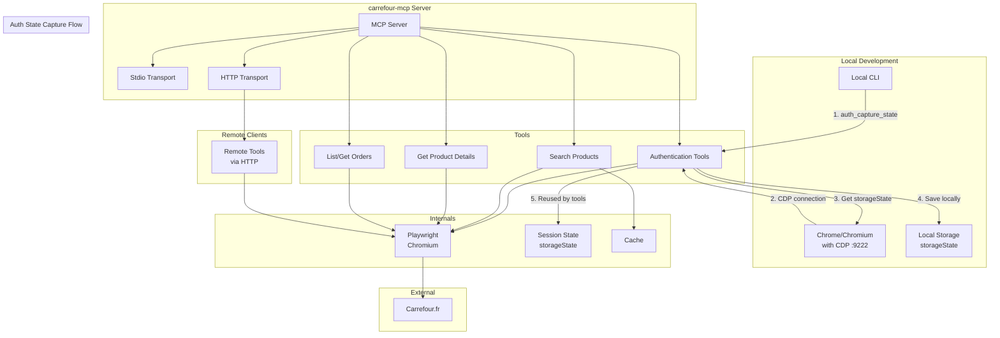

# carrefour-mcp

carrefour-mcp lets you search products on Carrefour France and get structured results.

## Features

- MCP tool available: search_products
- MCP tool available: get_product_details
- MCP tool available: auth_capture_state
- MCP tool available: auth_import_state
- MCP tool available: auth_status
- MCP tool available: auth_logout
- MCP tool available: list_orders
- MCP tool available: get_order_details
- Optional HTTP protection can be handled at deployment level (for example with Basic Auth on a reverse proxy)
- CLI command available: carrefour-mcp search_products
- CLI command available: carrefour-mcp get_product_details
- CLI command available: carrefour-mcp auth_login
- CLI command available: carrefour-mcp auth_capture_state
- CLI command available: carrefour-mcp auth_status
- CLI command available: carrefour-mcp auth_logout
- CLI command available: carrefour-mcp list_orders
- CLI command available: carrefour-mcp get_order_details
- Supported server modes: stdio, http, or both

## Architecture



## Prerequisites

- Node.js 20+
- pnpm 10+

## Installation

Install dependencies:

```bash
pnpm install
```

Install browser runtime:

```bash
pnpm install:browsers
```

For a Debian production machine, the repository also provides `deploy/scripts/install.sh`, which creates the Unix user, installs the required system packages (including `chromium` and `xauth`), clones or updates the repository on the server, downloads Chromium for Playwright, installs the systemd service, and restarts it after build when already running. If `deploy/scripts/install.sh` changes during repository update, the installer restarts itself once to apply the updated logic immediately. The deployed service unit uses an aggressive restart profile with a short restart delay and a reduced stop timeout.
The script can be copied and executed outside a local checkout; if `REPO_URL` is not provided and no local Git metadata is available, it defaults to `https://github.com/cbenz/carrefour-mcp` (branch `main` when not detected).
For remote login with GUI forwarding, `auth_login` prints an SSH `-Y` command that launches `chromium` with remote debugging on the target host.

## Start The MCP Server

Development mode:

```bash
MCP_TRANSPORT=stdio pnpm dev
MCP_TRANSPORT=http pnpm dev
MCP_TRANSPORT=both pnpm dev
```

Use a custom HTTP port:

```bash
MCP_TRANSPORT=http PORT=4000 pnpm dev
```

Production mode:

```bash
pnpm build
MCP_TRANSPORT=http pnpm start
```

## Use The CLI

Run directly from source (no rebuild required):

```bash
pnpm --silent cli search_products "jus de carottes"
pnpm --silent cli search_products "jus de carottes" --limit 5
pnpm --silent cli get_product_details "3608580823445"
pnpm --silent cli get_product_details "https://www.carrefour.fr/p/jus-de-carotte-pur-jus-carrefour-extra-3560070583379"
pnpm --silent cli auth_login
pnpm --silent cli auth_capture_state
pnpm --silent cli auth_capture_state --auth-state-path /tmp/auth-state.json
pnpm --silent cli auth_capture_state --cleanup-profile
pnpm --silent cli auth_status
pnpm --silent cli list_orders --limit 10
pnpm --silent cli list_orders --limit 10 --cdp-url http://127.0.0.1:9222
pnpm --silent cli list_orders --limit 20 --start-date 2024-01-01T00:00:00.000Z --end-date 2024-12-31T23:59:59.999Z
pnpm --silent cli get_order_details 649654675
pnpm --silent cli get_order_details 649654675 --cdp-url http://127.0.0.1:9222
pnpm --silent cli auth_logout
```

Use the installed binary command:

```bash
pnpm build
pnpm link --global
carrefour-mcp search_products "jus de carottes"
carrefour-mcp search_products "jus de carottes" --limit 5
carrefour-mcp get_product_details "3608580823445"
carrefour-mcp get_product_details "https://www.carrefour.fr/p/jus-de-carotte-pur-jus-carrefour-extra-3560070583379"
carrefour-mcp auth_login
carrefour-mcp auth_capture_state
carrefour-mcp auth_capture_state --auth-state-path /tmp/auth-state.json
carrefour-mcp auth_capture_state --cleanup-profile
carrefour-mcp auth_status
carrefour-mcp list_orders --limit 10
carrefour-mcp list_orders --limit 10 --cdp-url http://127.0.0.1:9222
carrefour-mcp get_order_details 649654675
carrefour-mcp get_order_details 649654675 --cdp-url http://127.0.0.1:9222
carrefour-mcp auth_logout
```

Output format:

- Raw JSON on stdout
- For script invocation, use `pnpm --silent cli ...` to keep stdout JSON-only and pipeable.

## Authenticate Your Carrefour Session

To access account-only features such as order history:

1. Run `auth_login` to print the recommended SSH command for launching remote Chromium with debugging:

```bash
pnpm --silent cli auth_login
```

`auth_login` prints a command in the form:

```bash
ssh -Y coursicota@203.0.113.42 chromium --remote-debugging-port=9222 --user-data-dir=/home/coursicota/.cache/carrefour-mcp/manual-chrome https://www.carrefour.fr/mon-compte
```

1. In that Chrome window, log in to Carrefour and validate the human check manually.

2. Capture the authenticated session state:

```bash
pnpm --silent cli auth_capture_state
```

1. Optional cleanup of the temporary manual Chrome profile after successful capture:

```bash
pnpm --silent cli auth_capture_state --cleanup-profile
```

1. The session state is saved locally and reused by authenticated tools.

When Carrefour returns 401 or 403 on authenticated API calls, carrefour-mcp now logs diagnostic details (request URL, status, and response body preview) on server stderr.

Authentication state is stored in a local JSON file (default path: `~/.cache/carrefour-mcp/auth-state.json`).
You can override it with `CARREFOUR_AUTH_STATE_PATH`.
For `auth_capture_state`, you can also use `--auth-state-path` or `CARREFOUR_AUTH_CAPTURE_STATE_PATH`.

Check status:

```bash
pnpm --silent cli auth_status
```

Clear local session state:

```bash
pnpm --silent cli auth_logout
```

List order history:

```bash
pnpm --silent cli list_orders
```

`list_orders` returns all available orders by default.
Use `--limit` only if you want to cap the number of returned orders.
If Carrefour temporarily refuses a later history page, the command still returns the orders already collected.

`list_orders` returns structured order history fields when available:

- order id
- order date
- order date in ISO format (`YYYY-MM-DD`)
- order amount and currency
- delivery time slot
- billed flag (`true` when the order is marked as invoiced)
- order detail URL

Returned orders are sorted by date from newest to oldest.

You can optionally filter orders by date range using `--start-date` and `--end-date` (ISO 8601 format):

```bash
pnpm --silent cli list_orders --start-date 2024-01-01T00:00:00.000Z --end-date 2024-12-31T23:59:59.999Z
```

`get_order_details` returns structured fields from a single order detail page:

- order id and URL
- order date (ISO format)
- billed flag
- delivery type, address, and delivery slot
- order total and currency
- invoice/reorder/refund URLs when available
- unavailable products count when available
- product lines including unavailable products sorted by product ID
- each product line can include name, product ID, category, packaging, quantity, prices, currency, and product URL
- category labels (for example `Conserves et Bocaux`) are included in each product's `category` field

If Cloudflare challenge pages are returned by automated browsing, reuse your manually authenticated Chrome session with CDP:

```bash
pnpm --silent cli list_orders --cdp-url http://127.0.0.1:9222
```

### Fallback: Capture Session From Existing Chrome

If you prefer to launch Chrome yourself, you can still run `auth_capture_state` directly.

1. Start Chrome with remote debugging enabled:

```bash
chromium --remote-debugging-port=9222 --user-data-dir="$HOME/.cache/carrefour-mcp/manual-chrome"
```

1. In that Chrome window, log in to Carrefour and validate the human check manually.

2. Capture the authenticated session state:

```bash
pnpm --silent cli auth_capture_state
```

Optional custom CDP endpoint:

```bash
pnpm --silent cli auth_capture_state --cdp-url http://127.0.0.1:9222
```

Optional cleanup with a custom profile path:

```bash
pnpm --silent cli auth_capture_state --cleanup-profile --profile-dir "$HOME/.cache/carrefour-mcp/manual-chrome"
```

`get_product_details` returns detailed product information when available, including:

- product name and URL
- price and currency
- price per unit (for example `€/L`)
- Nutri-Score
- ingredients and nutrition facts
- product images

You can pass either an absolute Carrefour product URL or a numeric product ID to `get_product_details`.

## HTTP Endpoints

- POST /mcp
- GET /health

Default local MCP URL:

- <http://127.0.0.1:3000/mcp>

## Cache Configuration

You can configure search caching with environment variables:

- CARREFOUR_SEARCH_CACHE_ENABLED (default: true)
- CARREFOUR_SEARCH_CACHE_DIR (default: .cache/carrefour-mcp)
- CARREFOUR_SEARCH_CACHE_TTL_MS (default: 900000)

## Authentication Configuration

- CARREFOUR_AUTH_ENABLED (default: true)
- CARREFOUR_AUTH_STATE_PATH (default: ~/.cache/carrefour-mcp/auth-state.json)
- CARREFOUR_AUTH_BROWSER_PROFILE_DIR (default: ~/.cache/carrefour-mcp/chromium-profile)
- CARREFOUR_AUTH_BROWSER_CHANNEL (optional: chromium, chrome, msedge)
- CARREFOUR_AUTH_LOGIN_TIMEOUT_MS (default: 180000)

### Remote GUI Login (SSH -Y)

`auth_login` supports remote GUI login workflows by printing an SSH forwarding command.
You can override the default SSH target with `CARREFOUR_AUTH_SSH_TARGET` or `--ssh-target`.
You can override the remote Chromium profile path with `CARREFOUR_AUTH_REMOTE_PROFILE_DIR`.
